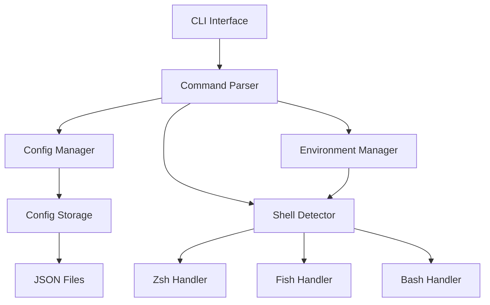

# Design Document

## Overview

env-config-switcher是一个用Rust开发的命令行工具，用于管理和快速切换环境变量配置。工具采用模块化设计，支持多种shell环境，并提供直观的命令行界面。

## Architecture



### 核心组件

1. **CLI Interface**: 处理用户输入和命令解析
2. **Config Manager**: 管理配置的CRUD操作
3. **Environment Manager**: 处理环境变量的设置和获取
4. **Shell Detector**: 检测当前shell类型并选择合适的处理器
5. **Config Storage**: 负责配置的持久化存储

## Components and Interfaces

### 1. CLI Interface (`src/cli.rs`)

```rust
use clap::{Parser, Subcommand};

#[derive(Parser)]
#[command(name = "envswitch")]
#[command(about = "A tool for managing and switching environment variable configurations")]
pub struct Cli {
    #[command(subcommand)]
    pub command: Commands,
}

#[derive(Subcommand)]
pub enum Commands {
    /// Create or update a configuration
    Set {
        /// Configuration alias name
        alias: String,
        /// Environment variables in KEY=VALUE format
        #[arg(short, long, value_parser = parse_env_var)]
        env: Vec<(String, String)>,
    },
    /// Switch to a configuration
    Use {
        /// Configuration alias to activate
        alias: String,
    },
    /// List all configurations
    List,
    /// Show current active configuration
    Status,
    /// Edit a configuration
    Edit {
        /// Configuration alias to edit
        alias: String,
    },
    /// Delete a configuration
    Delete {
        /// Configuration alias to delete
        alias: String,
    },
    /// Export configurations
    Export {
        /// Output file path
        #[arg(short, long)]
        output: Option<String>,
    },
    /// Import configurations
    Import {
        /// Input file path
        file: String,
    },
}
```

### 2. Config Manager (`src/config.rs`)

```rust
use serde::{Deserialize, Serialize};
use std::collections::HashMap;

#[derive(Debug, Clone, Serialize, Deserialize)]
pub struct EnvConfig {
    pub alias: String,
    pub variables: HashMap<String, String>,
    pub description: Option<String>,
    pub created_at: chrono::DateTime<chrono::Utc>,
    pub updated_at: chrono::DateTime<chrono::Utc>,
}

#[derive(Debug, Serialize, Deserialize)]
pub struct ConfigStore {
    pub configs: HashMap<String, EnvConfig>,
    pub active_config: Option<String>,
}

pub trait ConfigManager {
    fn load_configs(&self) -> Result<ConfigStore, ConfigError>;
    fn save_configs(&self, store: &ConfigStore) -> Result<(), ConfigError>;
    fn create_config(&self, alias: String, variables: HashMap<String, String>) -> Result<(), ConfigError>;
    fn update_config(&self, alias: String, variables: HashMap<String, String>) -> Result<(), ConfigError>;
    fn delete_config(&self, alias: String) -> Result<(), ConfigError>;
    fn get_config(&self, alias: &str) -> Result<Option<EnvConfig>, ConfigError>;
    fn list_configs(&self) -> Result<Vec<String>, ConfigError>;
    fn set_active_config(&self, alias: String) -> Result<(), ConfigError>;
    fn get_active_config(&self) -> Result<Option<String>, ConfigError>;
}
```

### 3. Environment Manager (`src/env.rs`)

```rust
use std::collections::HashMap;

pub trait EnvironmentManager {
    fn set_variables(&self, variables: &HashMap<String, String>) -> Result<(), EnvError>;
    fn get_variable(&self, key: &str) -> Option<String>;
    fn get_current_variables(&self, keys: &[String]) -> HashMap<String, Option<String>>;
    fn generate_shell_commands(&self, variables: &HashMap<String, String>) -> Result<String, EnvError>;
}

pub struct ShellEnvironmentManager {
    shell_type: ShellType,
}

#[derive(Debug, Clone)]
pub enum ShellType {
    Zsh,
    Fish,
    Bash,
    Unknown(String),
}
```

### 4. Shell Detector (`src/shell.rs`)

```rust
pub struct ShellDetector;

impl ShellDetector {
    pub fn detect_shell() -> ShellType {
        // 检测逻辑：
        // 1. 检查 $SHELL 环境变量
        // 2. 检查 $0 参数
        // 3. 检查父进程名称
        // 4. 默认返回 Unknown
    }
    
    pub fn get_shell_command_format(shell_type: &ShellType) -> ShellCommandFormat {
        match shell_type {
            ShellType::Zsh | ShellType::Bash => ShellCommandFormat::Export,
            ShellType::Fish => ShellCommandFormat::Set,
            ShellType::Unknown(_) => ShellCommandFormat::Export,
        }
    }
}

pub enum ShellCommandFormat {
    Export, // export KEY=VALUE
    Set,    // set -x KEY VALUE
}
```

## Data Models

### Configuration File Structure

配置文件存储在 `~/.config/envswitch/config.json`:

```json
{
  "configs": {
    "deepseek": {
      "alias": "deepseek",
      "variables": {
        "ANTHROPIC_BASE_URL": "https://api.deepseek.com",
        "ANTHROPIC_MODEL": "deepseek-chat",
        "ANTHROPIC_AUTH_TOKEN": "sk-xxx",
        "ANTHROPIC_SMALL_FAST_MODEL": "deepseek-chat"
      },
      "description": "DeepSeek v3.1 configuration",
      "created_at": "2024-01-01T00:00:00Z",
      "updated_at": "2024-01-01T00:00:00Z"
    },
    "kimi": {
      "alias": "kimi",
      "variables": {
        "ANTHROPIC_BASE_URL": "https://api.moonshot.cn",
        "ANTHROPIC_MODEL": "moonshot-v1-8k",
        "ANTHROPIC_AUTH_TOKEN": "sk-yyy",
        "ANTHROPIC_SMALL_FAST_MODEL": "moonshot-v1-8k"
      },
      "description": "Kimi k2 configuration",
      "created_at": "2024-01-01T00:00:00Z",
      "updated_at": "2024-01-01T00:00:00Z"
    }
  },
  "active_config": "deepseek"
}
```

### 状态文件

运行时状态存储在 `~/.config/envswitch/state.json`:

```json
{
  "current_session": {
    "active_config": "deepseek",
    "shell_type": "zsh",
    "pid": 12345,
    "started_at": "2024-01-01T10:00:00Z"
  }
}
```

## Error Handling

### 错误类型定义

```rust
#[derive(Debug, thiserror::Error)]
pub enum ConfigError {
    #[error("Configuration '{0}' not found")]
    ConfigNotFound(String),
    
    #[error("Configuration file error: {0}")]
    FileError(#[from] std::io::Error),
    
    #[error("JSON parsing error: {0}")]
    JsonError(#[from] serde_json::Error),
    
    #[error("Configuration '{0}' already exists")]
    ConfigExists(String),
}

#[derive(Debug, thiserror::Error)]
pub enum EnvError {
    #[error("Shell detection failed")]
    ShellDetectionFailed,
    
    #[error("Environment variable setting failed: {0}")]
    SetVariableFailed(String),
    
    #[error("Unsupported shell: {0}")]
    UnsupportedShell(String),
}
```

### 错误处理策略

1. **配置文件错误**: 提供详细错误信息和修复建议
2. **Shell兼容性**: 对不支持的shell提供警告但尝试通用方法
3. **网络相关**: 对于可能的网络配置错误提供诊断信息
4. **权限错误**: 清晰说明文件权限问题和解决方案

## Testing Strategy

### 单元测试

1. **Config Manager Tests**
   - 配置CRUD操作测试
   - JSON序列化/反序列化测试
   - 错误处理测试

2. **Environment Manager Tests**
   - 环境变量设置测试
   - Shell命令生成测试
   - 不同shell类型的兼容性测试

3. **Shell Detector Tests**
   - Shell类型检测测试
   - 命令格式生成测试

### 集成测试

1. **端到端工作流测试**
   - 创建配置 → 切换配置 → 验证环境变量
   - 导入导出配置测试
   - 多shell环境测试

2. **错误场景测试**
   - 配置文件损坏恢复测试
   - 权限不足场景测试
   - 不存在配置切换测试

### 手动测试

1. **Shell兼容性测试**
   - 在zsh、fish、bash中分别测试
   - 验证环境变量在不同shell中的持久性

2. **用户体验测试**
   - 命令行界面易用性
   - 错误信息清晰度
   - 帮助文档完整性

## Implementation Notes

### Shell集成策略

由于环境变量需要在当前shell会话中生效，工具将输出shell命令供用户执行：

```bash
# 用法示例
eval "$(envswitch use deepseek)"

# 或者创建shell函数/别名
alias switch-deepseek='eval "$(envswitch use deepseek)"'
alias switch-kimi='eval "$(envswitch use kimi)"'
```

### 配置文件位置

- 主配置: `~/.config/envswitch/config.json`
- 状态文件: `~/.config/envswitch/state.json`
- 日志文件: `~/.config/envswitch/logs/`

### 性能考虑

1. **配置加载**: 使用懒加载，只在需要时读取配置文件
2. **Shell检测**: 缓存shell类型检测结果
3. **JSON处理**: 使用serde进行高效的序列化/反序列化

### 安全考虑

1. **敏感信息**: 配置文件权限设置为600（仅用户可读写）
2. **输入验证**: 验证环境变量名称和值的合法性
3. **路径安全**: 防止路径遍历攻击